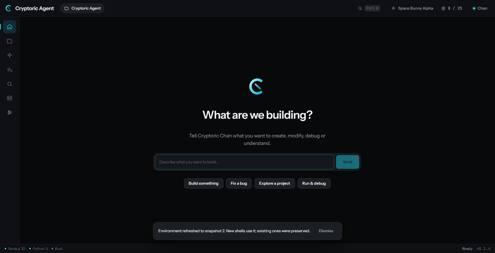
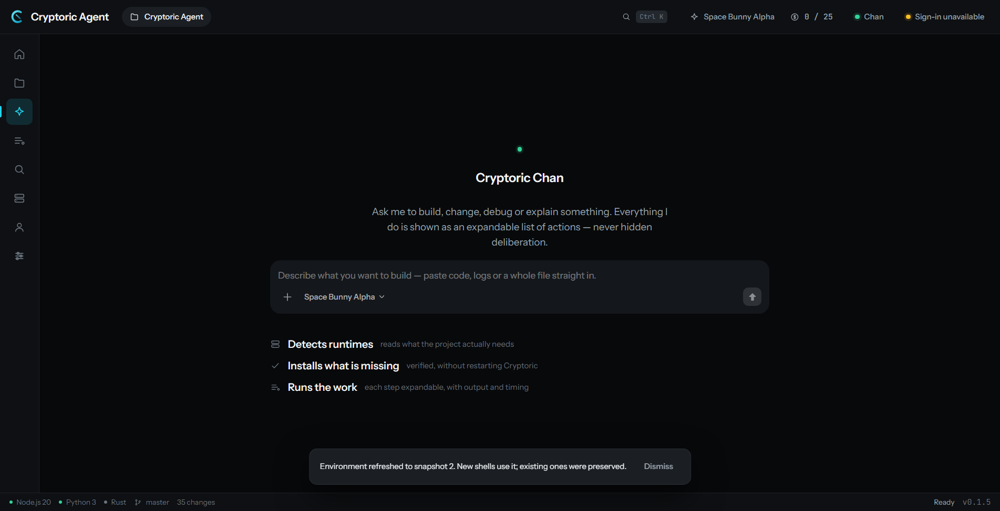
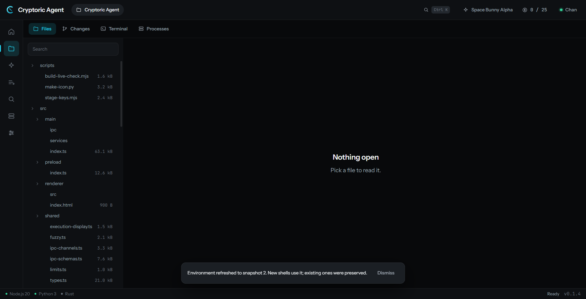
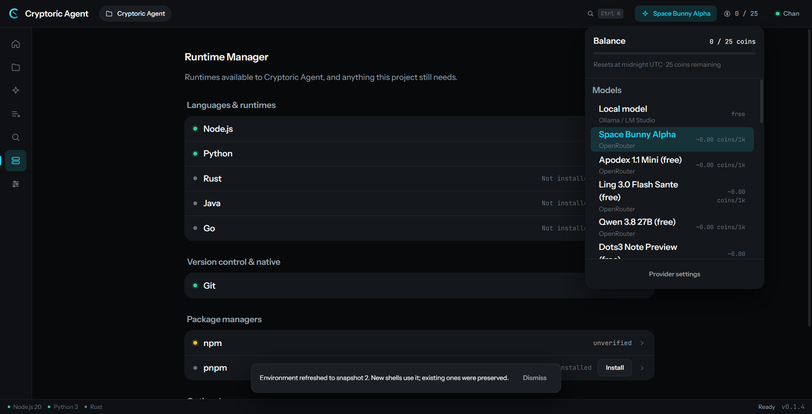
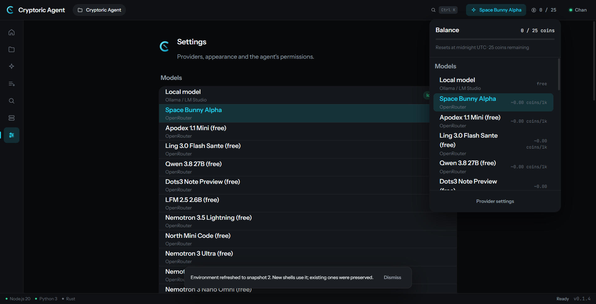
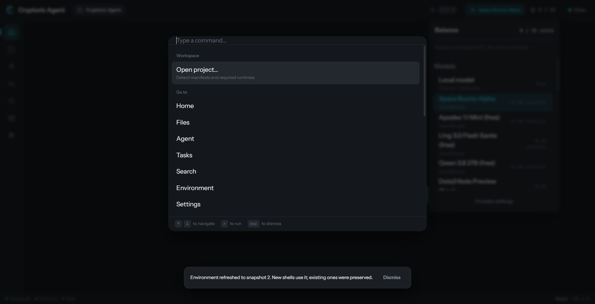
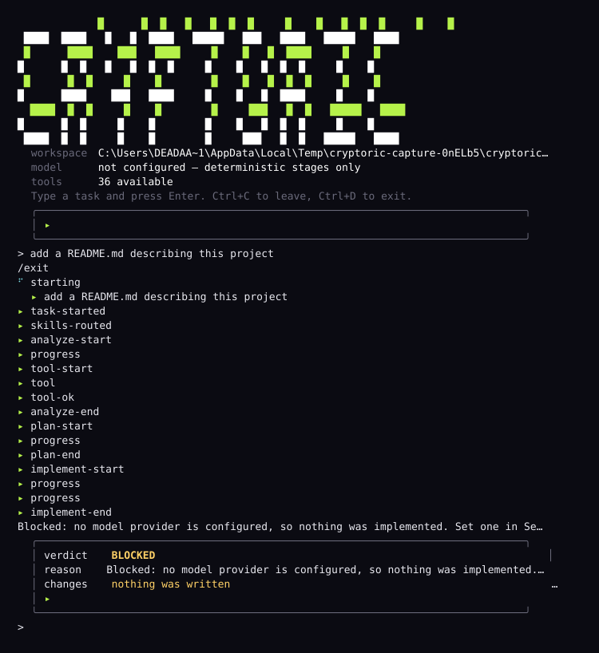

# Cryptoric Agent

**An AI-native development environment — a desktop app, a CLI, and a mobile
companion that all run the same agent. You bring the model.**

Cryptoric Agent runs an agent loop against **your** provider — OpenRouter, APINEX,
or anything OpenAI-compatible, including one on your own machine (Ollama,
LM Studio, llama.cpp, vLLM). It ships no key and no account. Three surfaces share
one pipeline:

| Surface | What it is | State |
|---|---|---|
| **Desktop** | Electron app, agent + browser + terminal | Ships as `.exe`, `.dmg`, `.AppImage`, `.deb` |
| **CLI** | `cryptoric`, one 425 KB file, no Electron | Verified; not yet on npm |
| **Mobile** | Swift companion + Node relay | **Library and tests only — no app ships** |

> **Bring your own key.** There is no Cryptoric account and no Cryptoric-funded
> quota. Requests go from your machine to the provider you chose, under your key.
> If you run a provider server yourself, your upstream key never reaches a
> client — see [Your own model server](#your-own-model-server).

---

## Screenshots

| | |
|---|---|
|  |  |
| **Home** — pick what you are building | **Cryptoric Chan** — the agent surface |
|  |  |
| **Workspace** — files, changes, terminal, processes | **Environment** — detects and installs runtimes |
|  |  |
| **Settings** — provider, models, permissions | **Command palette** — ⌘K |

The CLI session below is a **recording, not a mockup**.
[`scripts/capture-cli-svg.mjs`](scripts/capture-cli-svg.mjs) runs the real CLI
and renders whatever came back; CI re-runs it and fails if the committed SVG has
drifted.



It shows a `BLOCKED` verdict, because at capture time no model was configured.
That is the point: the session that cannot do the work says so instead of
implying success.

---

## What it actually does

You describe a task. The agent plans it, executes it against real tools, and
reports **what it observed** — not what it intended.

### Stages

Each stage has a declared permission ceiling, and each is entered and exited in
the transcript separately. That is deliberate: the UI used to tick a stage the
instant it *began*, so a task sitting inside implementation for ten minutes
showed a green tick the whole time.

### Safety

Every tool call goes through one runtime that owns policy, approval, timeout,
cancellation, redaction and audit. The agent never gets a second path.

### Browser

**44 browser tools**, driven by a real `WebContentsView`. Design Mode adds
`browser_inspect_element`: it returns markup, computed style and a selector for
the element you point at, atomically, so you can act on what is actually on
screen.

The verification stage reports one of five outcomes — `pass`, `fail`, `unknown`,
`not-applicable`, `error` — and **an observation it could not make is `unknown`,
never `pass`**.

### Projects, history and parallelism

Opening a folder creates `<root>/.cryptoricagent/` holding a stable project id
and the transcript. The folder writes its own `.gitignore` containing `*`, so it
never shows up as untracked noise in your repo.

History location is a setting: **app folder**, **project folder**, or **both**
(default). Multiple projects run in **parallel**, and two tasks in the *same*
folder never overlap — that guarantee is what stops two agents overwriting each
other's files, and it is tested by counting tasks inside a critical section, not
by measuring how long they took.

### Session time, in coins

**5 coins buys 30 minutes.** One coin is six minutes. Each model costs between
**5 and 10** — 5 for one you brought yourself or run locally, 10 for one Cryptoric
pays for, and never below 5.

The block is charged when a task starts, not per request, so a session is
predictable. With **no coins the agent does not run**: the charge happens before
the first tool call, and the task is marked `BLOCKED` with the reason. The bought
time *is* the agent loop's runtime ceiling, so the same mechanism that stops a
runaway task stops an exhausted one.

Close the app mid-task and it **resumes on launch**, on the session already
paid for — reopening never charges twice.

### Coins

**20 coins a day**, plus a **25 coin** one-time signup bonus that replaces that
day's allowance rather than adding to it. A user with their own key is never
metered.

---

## Bring your own API

Settings → Models → **Add provider**. Pick from a searchable list — OpenRouter,
OpenAI, Ollama, LM Studio, Groq, Together, Mistral, DeepSeek, or Custom — and the
base URL and a model id are filled in for you. A preset is a shortcut, not a
restriction: the URL stays editable, so your own gateway is always allowed.

- **Base URL** — validated before anything is sent.
- **API key** — a password field with a Show toggle, written straight to the OS
  credential store. Never in settings, never in a project file, never sent back
  to the renderer. Local servers are not asked for one.
- **Model ID** — copied from the provider, because a wrong id is a 404 with
  nothing useful in it.

Under **Advanced settings**: a connection name, extra models, and two optional
token budgets.

**Context window tokens** and **Maximum output tokens** are limits *you*
declare, not capabilities the app detects. The ceiling clamps every reply — a
stage that wants a short summary still gets one. A conversation longer than the
window is stopped with both numbers in the message, rather than being sent and
rejected opaquely. Leave them blank and the model stays uncapped.

Rules that exist because the alternative fails quietly:

- Each provider gets its **own** credential slot; a shared one would mean
  removing a provider deletes another's key.
- Provider ids are **slugged**, so a crafted name cannot address another
  provider's secret.
- A key pasted into a URL is **rejected** — it would otherwise land in settings,
  logs and any crash report.
- Saving the same name **updates** rather than duplicating; editing never makes
  you retype a stored key.

---

## Your own model server

`server/index.mjs`, zero dependencies. You run it, installs point at it, and the
models you publish appear in the app. Installs fetch a catalogue and a token for
*your* server; **your upstream key never reaches a client.**

The security properties are enforced in code, not just written down:

- The token is **mandatory** — the server refuses to start without one, because
  an unauthenticated provider server is an open proxy to your upstream key.
- Comparison is **constant-time**, so the token cannot be leaked a character at
  a time.
- Request bodies are **capped**.
- The client **refuses to send its token over plain `http:`** to a non-loopback
  host, with an explicit opt-out for a trusted LAN.

17 tests start the real server and fetch it over loopback.

---

## The CLI

```bash
cryptoric                    # interactive session: type a task, get a verdict
cryptoric run "<task>"       # one-shot, exits non-zero when the work is blocked
cryptoric run "<task>" --json
```

The same pipeline, the same tools, the same verdicts — assembled around argv and
a pipe instead of a window. One file — 425 KB as the bundler reports it — with
no Electron, built with the esbuild already in the repo so it installs nothing
extra.

With no model configured it exits **2** and reports `BLOCKED` with a reason.
`--json` carries that reason too; an earlier build returned a verdict with
`reason: null`, which is a bug this repository caught in its own CI.


---

## The mobile companion

**No mobile app ships. Nothing here puts anything on a phone.**

What exists is real and verified, and it is smaller than an app:

- `mobile/ios` — a Swift package (`CryptoricKit`) holding the relay protocol,
  client and SwiftUI views. It compiles and its tests pass on a GitHub macOS
  runner, and the job **fails** unless the suite reports `Executed N tests` with
  N ≥ 10.
- `mobile/relay` — a zero-dependency Node relay, **17/17** tests.

What does *not* exist: an Xcode app target, an `.app`, an `.ipa`, an Android
project, an `.apk`. There are no mobile artifacts in any published release, and
there never have been.

Both are buildable, and the obstacles are different from the usual story:

- **An `.ipa` needs no Apple account to *produce*.** A macOS runner can build an
  app target with `CODE_SIGNING_ALLOWED=NO` and zip the `.app` into an `.ipa`.
  What the paid account buys is *installing* it on a device without re-signing
  first. The blocker here is that no app target exists — only a library.
- **An `.apk` needs no account at all.** Gradle signs a debug build with a
  throwaway key. The blocker here is that there is no Android project whatsoever:
  no `AndroidManifest.xml`, no `build.gradle`, no wrapper.

Neither is a packaging step away. Both are a project that has to be written
first — which is exactly what the next thing to build is.

---

## Install

Download a build from [releases](https://github.com/Itz-Npg/Cryptoric-Agent/releases).

| Platform | Asset |
|---|---|
| Windows x64 | `CryptoricAgent-<version>-x64.exe` |
| macOS (Apple silicon) | `CryptoricAgent-<version>-arm64.dmg` |
| macOS (Intel) | `CryptoricAgent-<version>.dmg` |
| Linux | `CryptoricAgent-<version>.AppImage`, `cryptoricagent_<version>_amd64.deb` |

### From source

```bash
npm install
npm run dev
```

Node ≥ 20.11.

---

## Bring your own key

Copy `.env.example` to `.env` and fill it in, or skip the file entirely and paste
keys into Settings. The `.env` route moves a key into the OS-encrypted credential
store once; a key already in the store always wins.

---

## How it's built

- Electron 33 + Vite, TypeScript, React renderer.
- **Zero runtime dependencies in the main process beyond `zod`.**
- **971 tests across 44 files**, run on every push.
- CI: **Build and Release**, **CLI**, **Mobile companion** — all green on `main`.

---

## Code signing

### Verifying a download

**Today there are none.** All 23 assets across the five published releases carry
zero `.asc` files, and this README will not pretend otherwise. The signing job
exists and is proven against the real installer, but it needs the
`CRYPTORIC_GPG_KEY` repository secret and a pinned fingerprint, and **fails
loudly** rather than skipping when they are absent.

Once they are set, a release will have one per asset, and you will check it like
this:

```bash
gpg --keyserver hkps://keys.openpgp.org --recv-keys 152873138+Itz-Npg@users.noreply.github.com
gpg --verify cryptoric-agent_<version>_amd64.deb.asc cryptoric-agent_<version>_amd64.deb
```

A `GOOD` line is what you are looking for. `BAD` means the file does not match
what was signed — do not run it.

### Code signing policy

- **Authenticode is not in use.** Binaries are GPG-signed, which proves
  provenance but does **not** clear SmartScreen. A SignPath Foundation grant
  would; that is an external human application.
- **Contributors never receive the signing key.** The private key and its
  passphrase exist only on the maintainer's machine, and are not backed up
  anywhere.

### Attestation

This project states what it verified and what it did not. "Definition of done"
means a command that proves it, **and that command has been run**. Where a check
could not run, that is written down below rather than left to look like success.

---

## Status — honestly

**Verified, with the command that proves it:**

- Agent loop, stages, evidence gate and tool runtime — 971 unit tests, all green.
- **Browser** — `npm run test:browser` → **64/64 against real Chromium**, 44 tools.
- **CLI** — builds Electron-free, and a real run with no model exits **2
  `BLOCKED`**, writes nothing, and explains why in both human and JSON output.
- **iOS companion** — `swift build` + `swift test` on a GitHub macOS runner.
- **Relay** — 17/17.
- **Session economy** — the exchange rate, the price floor, the zero-coin gate
  (the stage provably never runs), the ledger, and resume-without-a-second-charge.
- **Signing** — a real sign/verify round trip on the real installer; one appended
  byte turns it `BAD`.
- **Sign-in** — the loopback listener against a real socket, the *ordering* that
  binds the port before the browser opens (a fake browser asks the port whether
  it is open; the wrong order fails the test), the session store, and the pane
  itself: `npm run test:account` renders it in all five states and checks the
  right control is drawn.
- **Hosted billing** — the app asks the server what a session costs and uses
  its numbers; an unreachable server refuses the task instead of running it
  free; a resumed task sends no request. Verified against the real handler on a
  real socket, never against a deployment.

**Not done — stated rather than implied:**

- **No mobile app ships.** No `.ipa`, no `.apk`, no Xcode app target, no Android
  project. See [The mobile companion](#the-mobile-companion).
- **The browser check does not run in CI.** It passes 64/64 on a desktop, but
  under `xvfb` the tools needing a real pointer path or a composited surface
  fail. Software-rendering switches were tried and rejected. There is no
  headless variant, because inventing one would mean testing a fake.
- **Runtime installation is Windows-only.** Every installer id is `-winget`;
  macOS and Linux correctly refuse.
- **The CLI has never run against a live model provider.** Every CLI result here
  was produced with no key set. That is the path which must refuse to claim
  success, and it does — but the model path itself is untested end to end.
- **In `local` mode the coin limit is enforced on the user's machine.** The
  balance is a file, which raises the cost of cheating without making it
  impossible. `hosted` mode is the answer to that — it asks the server — but
  only if someone runs one.
- **Multi-project execution is real; the UI is not.** There is no sidebar yet to
  switch between folders.
- **The provider server has never been published.** It is tested against itself
  over loopback, not against a live deployment.
- **The Google handshake has never run against Google.** Every piece around it is
  tested, but the code exchange needs a real `GOOGLE_CLIENT_ID` — a Desktop app
  client id whose redirect URI is `http://127.0.0.1:53123/callback` — and only
  the maintainer can create one.
- **`hosted` mode is charged, but only against a server you control.** It has
  never run against a deployment: `AGENT_SERVER_URL` and `AGENT_SERVER_TOKEN`
  are yours to set, and no Vercel deployment exists. The billing path is
  verified against the real handler on a real socket.

---

## Contributing

One maintainer. Commits carry **no co-author trailers** — GitHub counts every
co-author, and this project has exactly one. Credentials are never shared: the
signing key, the Apple account, the npm token and every provider key belong to
the maintainer alone, and [`.env.example`](.env.example) says so where a secret
is expected.

---

## License

[MIT](LICENSE) © 2026 Itz-Npg